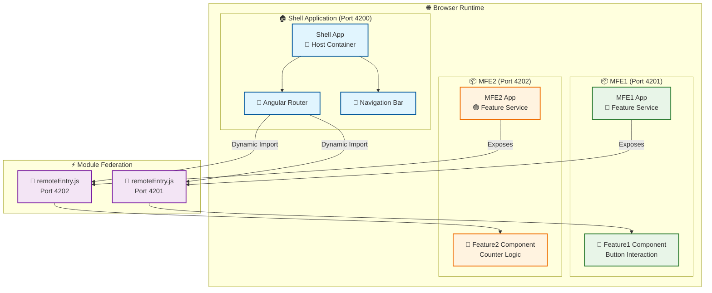
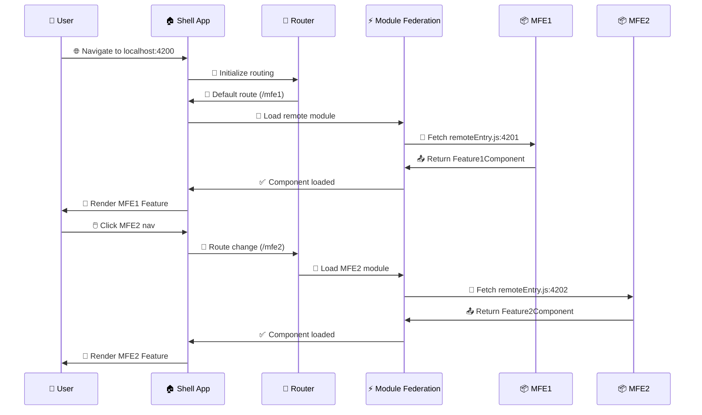

# 🏗️ Webpack Microfrontend Architecture

This project demonstrates a complete microfrontend architecture using Angular and Webpack Module Federation. It consists of a shell (host) application that dynamically loads two separate Angular microfrontend applications.

## 🏛️ Architecture Overview



## 🚀 Runtime Flow



## 📱 Applications

### 🏠 Shell Application (Port 4200)
- **Purpose**: Host application that loads and orchestrates microfrontends
- **Features**: 
  - 🧭 Navigation between microfrontends
  - 🎨 Shared layout and styling
  - ⚙️ Module Federation host configuration

### 📦 MFE1 (Port 4201)
- **Purpose**: First microfrontend application
- **Exposed Component**: `Feature1Component`
- **Features**: 
  - 🔵 Simple feature with button interaction
  - 🎨 Blue-themed styling

### 📦 MFE2 (Port 4202)
- **Purpose**: Second microfrontend application  
- **Exposed Component**: `Feature2Component`
- **Features**: 
  - 🔢 Counter functionality with increment/decrement
  - 🟢 Green-themed styling

## 🛠️ Technology Stack

- **🅰️ Angular 17+** - Modern Angular framework with standalone components
- **📦 Webpack 5** - Module bundler with Module Federation plugin
- **⚡ Module Federation** - Runtime integration of microfrontends
- **📘 TypeScript** - Type-safe development
- **🎨 CSS3** - Responsive styling

## 🚀 Getting Started

### 📋 Prerequisites

- 🟢 Node.js 18+ and npm
- 🅰️ Angular CLI (`npm install -g @angular/cli`)

### 📥 Installation

1. **📂 Clone the repository** (if applicable) or ensure you're in the project directory

2. **📦 Install dependencies for all applications**:
   ```bash
   cd shell && npm install
   cd ../mfe1 && npm install  
   cd ../mfe2 && npm install
   ```

### 🔧 Development

You can run the applications individually or all together:

#### ✅ Option 1: Run All Applications (Recommended)
Use the VS Code task to start all applications at once:
1. Open VS Code Command Palette (`Ctrl+Shift+P` or `Cmd+Shift+P`)
2. Type "Tasks: Run Task"
3. Select "Start All Microfrontends"

This will start:
- 📦 MFE1 on http://localhost:4201
- 📦 MFE2 on http://localhost:4202  
- 🏠 Shell on http://localhost:4200

#### 🔄 Option 2: Run Applications Individually

**💻 Terminal 1 - Start MFE1:**
```bash
cd mfe1
npm start
```

**💻 Terminal 2 - Start MFE2:**
```bash
cd mfe2
npm start
```

**💻 Terminal 3 - Start Shell:**
```bash
cd shell
npm start
```

### 🌐 Accessing the Application

1. **🏠 Main Application**: http://localhost:4200
   - 🧭 Navigate between MFE1 and MFE2 using the top navigation
   - ⚡ The shell application loads microfrontends dynamically

2. **🔍 Individual Microfrontends** (for development/testing):
   - 📦 MFE1: http://localhost:4201
   - 📦 MFE2: http://localhost:4202

## 📁 Project Structure

```
micro-fe/
├── .github/
│   └── copilot-instructions.md     # AI assistant instructions
├── .vscode/
│   └── tasks.json                  # VS Code tasks for running apps
├── shell/                          # Host application
│   ├── src/app/
│   │   ├── app.ts                  # Main app component
│   │   ├── app.html                # Shell layout template
│   │   ├── app.css                 # Shell styling
│   │   └── app.routes.ts           # Route configuration with MF loading
│   ├── webpack.config.js           # Module Federation host config
│   └── package.json
├── mfe1/                           # First microfrontend
│   ├── src/app/
│   │   └── feature1/               # Exposed feature component
│   │       ├── feature1.ts
│   │       ├── feature1.html
│   │       └── feature1.css
│   ├── webpack.config.js           # Module Federation remote config
│   └── package.json
├── mfe2/                           # Second microfrontend
│   ├── src/app/
│   │   ├── feature1/               # First feature component
│   │   └── feature2/               # Second feature component (exposed)
│   ├── webpack.config.js           # Module Federation remote config
│   └── package.json
└── README.md                       # This file
```

## ⚙️ Module Federation Configuration

### 🏠 Shell (Host) Configuration
```javascript
// shell/webpack.config.js
module.exports = withModuleFederationPlugin({
  remotes: {
    "mfe1": "http://localhost:4201/remoteEntry.js",
    "mfe2": "http://localhost:4202/remoteEntry.js",
  },
  // ... shared dependencies
});
```

### 📦 MFE1 (Remote) Configuration
```javascript
// mfe1/webpack.config.js  
module.exports = withModuleFederationPlugin({
  name: 'mfe1',
  exposes: {
    './Feature1Component': './src/app/feature1/feature1.ts',
  },
  // ... shared dependencies
});
```

### 📦 MFE2 (Remote) Configuration
```javascript
// mfe2/webpack.config.js
module.exports = withModuleFederationPlugin({
  name: 'mfe2',
  exposes: {
    './Feature2Component': './src/app/feature2/feature2.ts',
  },
  // ... shared dependencies
});
```

## ✨ Key Features

### ⚡ Dynamic Loading
- 🚀 Microfrontends are loaded on-demand through Angular routing
- 🔗 Runtime integration without build-time coupling
- 🚢 Independent deployment capability

### 🤝 Shared Dependencies  
- 📚 Common Angular libraries shared between applications
- 📦 Optimized bundle sizes through dependency sharing
- 🔄 Version compatibility management

### 🔧 Independent Development
- 🏗️ Each microfrontend can be developed, tested, and deployed independently
- 🖥️ Separate development servers for isolated testing
- 📋 Own package.json and dependency management

## 📖 Development Guidelines

### ➕ Adding New Features
1. 🛠️ Create components in the respective microfrontend
2. ⚙️ Update webpack.config.js to expose new components
3. 🔀 Update shell routes to load new components
4. 🧪 Test both in isolation and integrated

### 🤝 Shared Dependencies
- ➕ Add shared dependencies to the `shared` object in webpack configs
- 🎯 Use singleton pattern for Angular core libraries
- ✅ Test compatibility between different versions

### 🎨 Styling
- 🔒 Use scoped CSS to avoid style conflicts
- 🎭 Consider CSS custom properties for theming
- 👀 Test visual consistency across microfrontends

## 🔧 Troubleshooting

### ⚠️ Common Issues

1. **⚡ Module Federation Loading Errors**
   - ✅ Ensure all development servers are running
   - 🌐 Check network connectivity between applications
   - 🔍 Verify exposed module names match import statements

2. **🔌 Port Conflicts**
   - 🔧 Change ports in webpack configurations if needed
   - 🔄 Update remote URLs in shell configuration
   - 🔁 Restart development servers after port changes

3. **📦 Dependency Version Conflicts**
   - 🎯 Align Angular versions across all applications  
   - ✅ Check shared dependency configurations
   - 🔗 Use peer dependencies for shared libraries

### 🐛 Debug Tips
- 🌐 Use browser DevTools Network tab to verify remote entry loading
- 🔍 Check console for Module Federation specific errors
- 🧪 Test microfrontends individually before integration

## 🏗️ Production Build

```bash
# Build all applications for production
cd shell && npm run build
cd ../mfe1 && npm run build  
cd ../mfe2 && npm run build
```

## 🤝 Contributing

1. 📋 Follow Angular style guide for component development
2. 🏗️ Maintain microfrontend independence principles
3. 🧪 Test both isolated and integrated scenarios
4. 📝 Update documentation for new features

## 📄 License

This project is for demonstration purposes. 🎓